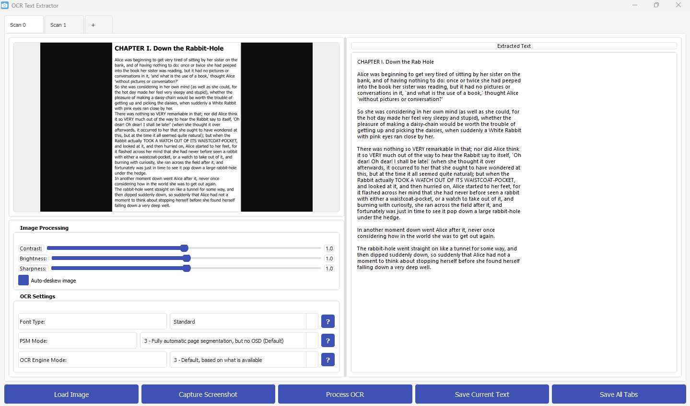
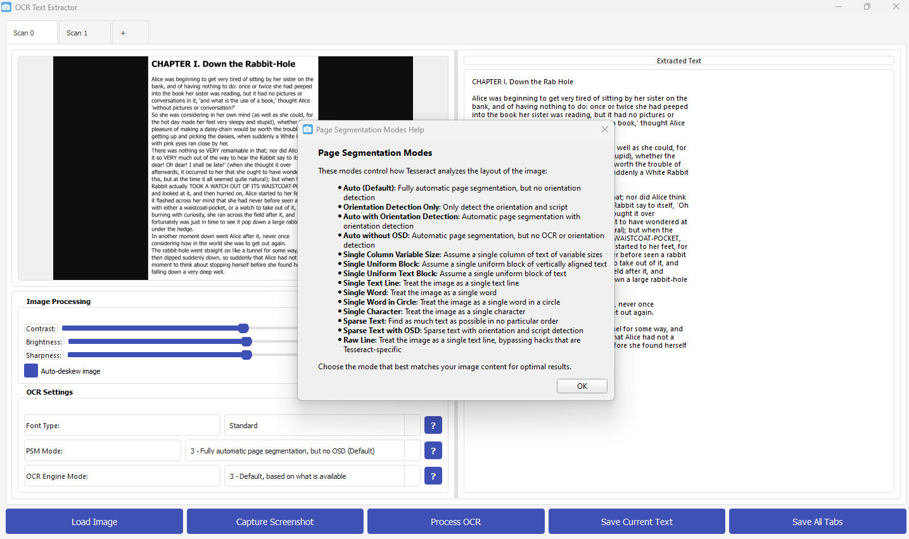

<h1 align="center">OCR Text Extractor</h1>

<p align="center">
  A desktop application that extracts text from images and screenshots using Tesseract OCR.
  <br>
  <br>
  
  
  
  
</p>



## Features

- **Screenshot Capture**: Capture screenshots directly from the application
- **Image Loading**: Load images from your computer
- **OCR Processing**: Extract text from images using Tesseract OCR
- **Text Editing**: Edit extracted text before saving
- **Image Adjustments**: Adjust contrast, brightness, and sharpness for better OCR results
- **Multiple Tabs**: Work with multiple images simultaneously

## Application Interface

The application features a clean, modern interface with multiple tabs for working with different images simultaneously:



## Installation

### Option 1: Windows Installer (Recommended)

1. Download the [OCR Text Extractor Setup](https://github.com/kbtale/ocr-to-txt/releases/latest/download/OCR_Text_Extractor_Setup.exe) from the releases page
2. Run the installer and follow the on-screen instructions
3. The installer will automatically install Tesseract OCR for you

### Option 2: Manual Installation

1. Clone this repository:
   ```
   git clone https://github.com/kbtale/ocr-to-txt.git
   cd ocr-to-txt
   ```

2. Install the required Python packages:
   ```
   pip install -r requirements.txt
   ```
   
   Or use the provided setup script on Windows:
   ```
   setup.bat
   ```

3. Install Tesseract OCR:
   - **Windows**: Download and install from [https://github.com/UB-Mannheim/tesseract/wiki](https://github.com/UB-Mannheim/tesseract/wiki)
   - **macOS**: `brew install tesseract`
   - **Linux**: `sudo apt install tesseract-ocr`

4. Make sure the Tesseract executable is in your system PATH or specify its location in the application settings.

## Quick Start

1. Run the application:
   - If you used the installer, launch from the Start menu or desktop shortcut
   - If you installed manually:
     ```
     python src/main.py
     ```
     
     Or use the provided batch file on Windows:
     ```
     run.bat
     ```

2. Use the "Capture Screenshot" or "Load Image" buttons to get an image into the application

3. Adjust image processing settings if needed (contrast, brightness, etc.)

4. The OCR text will appear in the right panel where you can edit it

5. Use the "Save Text" option from the File menu to save your data

## Advanced Options

- **Page Segmentation Mode (PSM)**: Controls how Tesseract analyzes the layout of the image
- **OCR Engine Mode (OEM)**: Selects which OCR engine Tesseract uses
- **Font Type**: Optimizes processing for different types of fonts
- **Auto-deskew**: Automatically straightens tilted images for better OCR results

## Troubleshooting

If you encounter issues with OCR quality:

1. Ensure your image has sufficient resolution (300 DPI recommended)
2. Try adjusting contrast and brightness
3. Experiment with different PSM modes
4. Make sure Tesseract is properly installed and accessible

## License

This project is licensed under the MIT License - see the LICENSE file for details.
